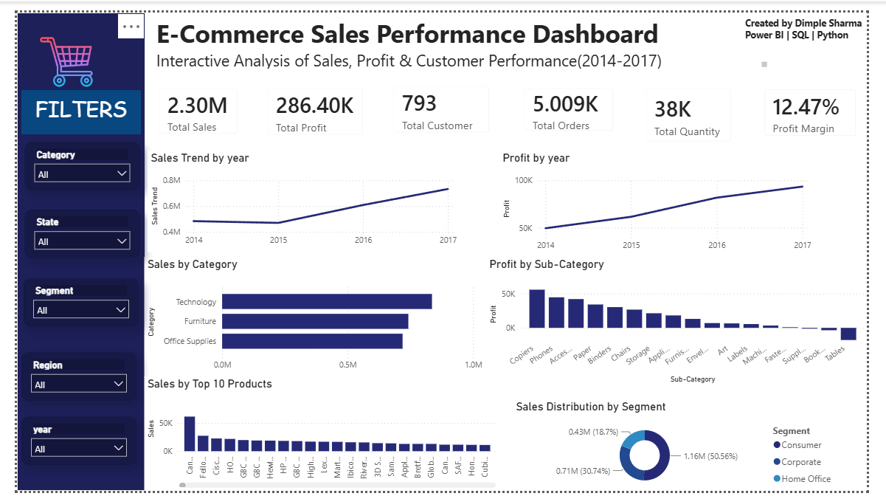

# 📊 E-Commerce Sales Analytics Dashboard

An interactive Business Intelligence dashboard built using **Python, SQL, and Power BI** to analyze sales performance, profitability, customer behavior, and product trends. The project demonstrates the complete data analytics workflow—from data cleaning and exploratory analysis to SQL querying and interactive dashboard creation.

---

## 📌 Project Overview

Businesses generate large volumes of sales data every day. This project analyzes an e-commerce dataset to identify key business insights related to sales, profit, customer segments, regional performance, and product performance.

The dashboard enables users to interactively explore business metrics using filters and visualizations, making it easier to support data-driven decision-making.

---

## 🎯 Objectives

- Analyze overall sales and profitability
- Identify high-performing product categories
- Analyze yearly sales and profit trends
- Understand customer segment distribution
- Identify the most profitable sub-categories
- Discover top-selling products
- Build an interactive executive dashboard

---

## 🛠️ Tech Stack

- **Python**
  - Pandas
  - NumPy
  - Matplotlib

- **SQL**
  - MySQL Workbench

- **Power BI**
  - Interactive Dashboard
  - DAX Measures
  - KPI Cards
  - Slicers

---

## 📂 Dataset

Dataset: **Sample Superstore**

The dataset contains information related to:

- Orders
- Customers
- Products
- Categories
- Regions
- Sales
- Profit
- Quantity
- Shipping

---

## 📈 Dashboard Features

✔ Total Sales KPI

✔ Total Profit KPI

✔ Total Customers

✔ Total Orders

✔ Total Quantity Sold

✔ Profit Margin

✔ Sales Trend Analysis

✔ Profit Trend Analysis

✔ Sales by Category

✔ Profit by Sub-Category

✔ Top 10 Products

✔ Sales Distribution by Customer Segment

✔ Interactive Filters

---

## 📊 Dashboard Preview


---

## 🔍 Key Insights

- Technology generated the highest sales.
- Sales increased consistently from 2015 to 2017.
- Consumer segment contributed the largest share of sales.
- Tables showed negative profitability.
- A small number of products contributed significantly to total revenue.

---

## 📁 Project Structure

```text
ecommerce-sales-analytics-dashboard/
│
├── Dashboard.png
├── ECOMMERCE.pbix
├── Ecommerce_Analysis.ipynb
├── SQL_Queries.sql
├── Sample_Superstore.csv
└── README.md
```

---

## 🚀 How to Run

1. Download the repository.
2. Open the Jupyter Notebook to view data cleaning and exploratory analysis.
3. Execute the SQL queries using MySQL Workbench.
4. Open the Power BI (.pbix) file in Power BI Desktop.
5. Interact with the dashboard using the available slicers.

---

## 📚 Skills Demonstrated

- Data Cleaning
- Exploratory Data Analysis (EDA)
- SQL Querying
- Data Visualization
- Business Intelligence
- Dashboard Design
- DAX Measures
- KPI Development
- Business Insights

---

## 👩‍💻 Author

**Dimple Sharma**

Power BI | SQL | Python | Data Analytics

---

⭐ If you found this project useful, consider giving it a star.
